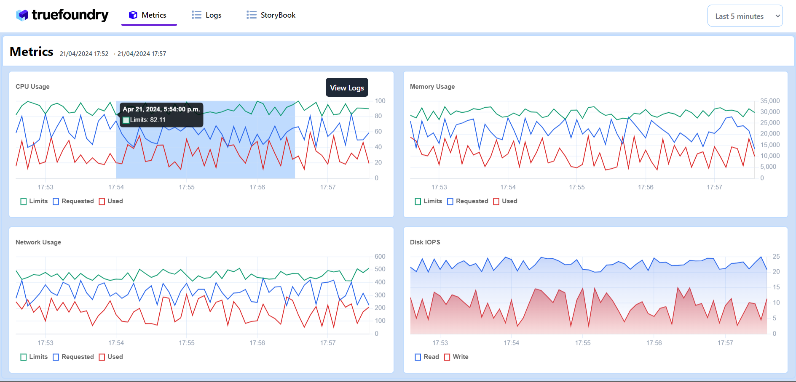
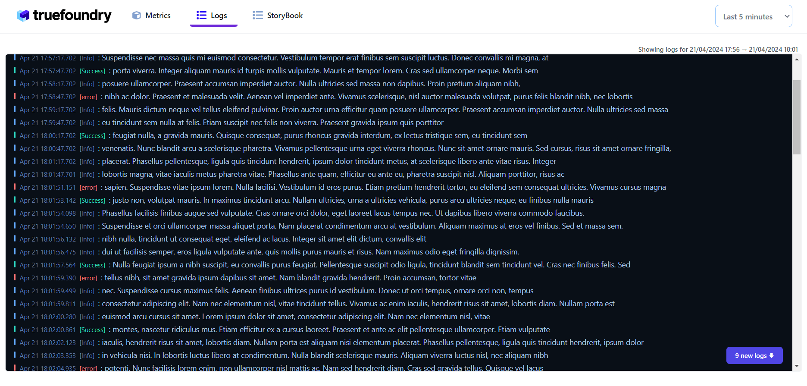
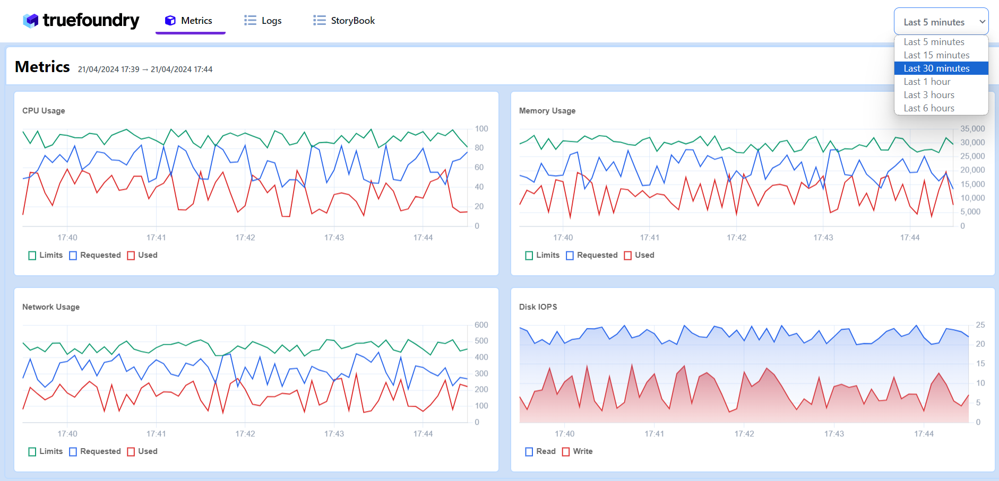
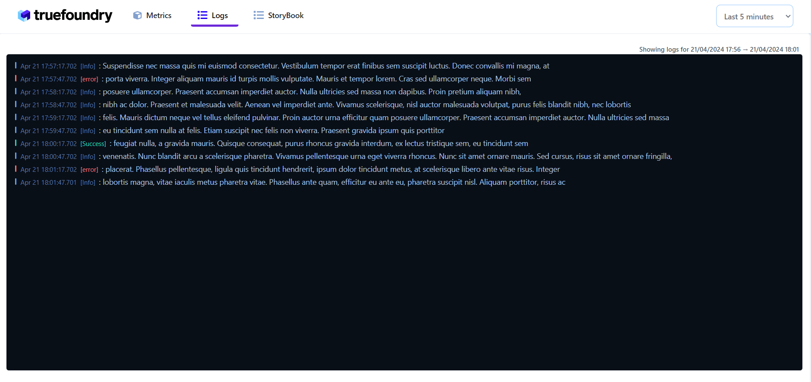
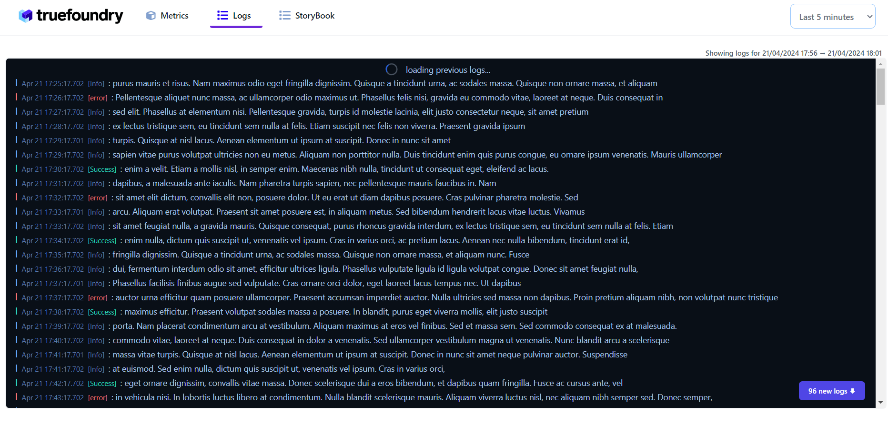
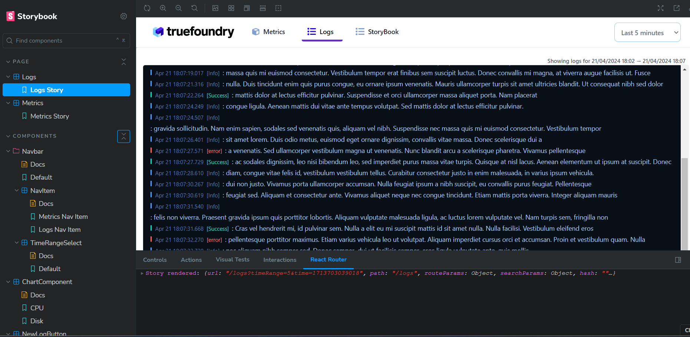

# Logs and Metrics Viewer (React Project)

## Overview
This React application allows users to fetch and view system logs and metrics. It consists of two screens, Logs, and Metrics, which can be toggled between using a Navbar. The application utilizes React Router for SPA navigation.

## Features
### Metrics:
- Four charts (mix of line and area charts) rendered using Chart.js with React.
- Time range based filtering of system logs similar to the logs screen.
- Selection and drag over any section within a chart to view logs for the corresponding time range.
- Shareable URL with states of metric filters reflected in the URL.

### Logs:
- Terminal-like view for rendering logs.
- Quick selections for time-range (Last {n} minutes/hours) with live logs.
- Custom time range selection with a date and time range picker.
- Subscription to live logs with continuous populating at the bottom.
- Autoscroll for new logs if the user is positioned at the latest log line.
- Infinite scroll and pagination for previous logs.
- Shareable URL with states of log filters reflected in the URL.

## Component Library and Storybook
All components created are part of a component library documented using Storybook. The Storybook includes:
- Hierarchical list of all components used.
- Preview of all components.
- Props usage of all components.

## URL Scheme
- Logs: /logs
- Metrics: /metrics
- Storybook: /storybook

## Dependencies
- React: 17+
- react-chartjs-2: 4+
- chart.js: 4+
- chartjs-adapter-date-fns: 3+
- react-router-dom: 6+
- tailwindcss: 3+
- @storybook/react: 7+
- storybook-addon-remix-react-router: 3+
- date-fns: 3.6.0

## Getting Started
1. Clone the repository: `git clone https://github.com/shubham691438/frontend-assignment.git`
2. Install dependencies: `npm install`
3. Run the application: `npm run dev`
4. Run the storybook: `npm run storybook`

## Contributing
Contributions are welcome! Please follow the guidelines outlined in the CONTRIBUTING.md file.

## License
This project is licensed under the MIT License. See the LICENSE file for details.
